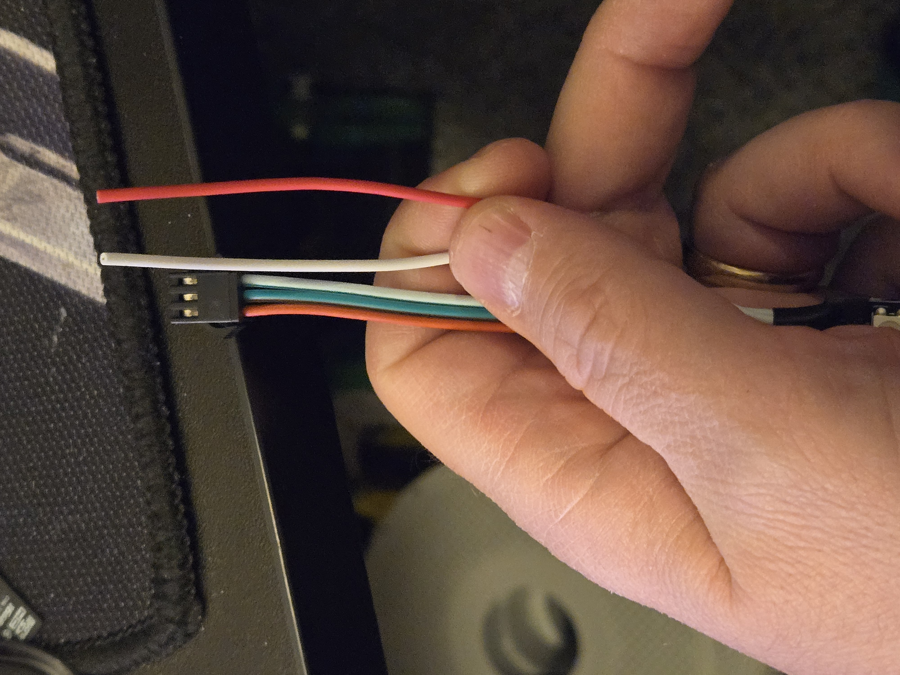
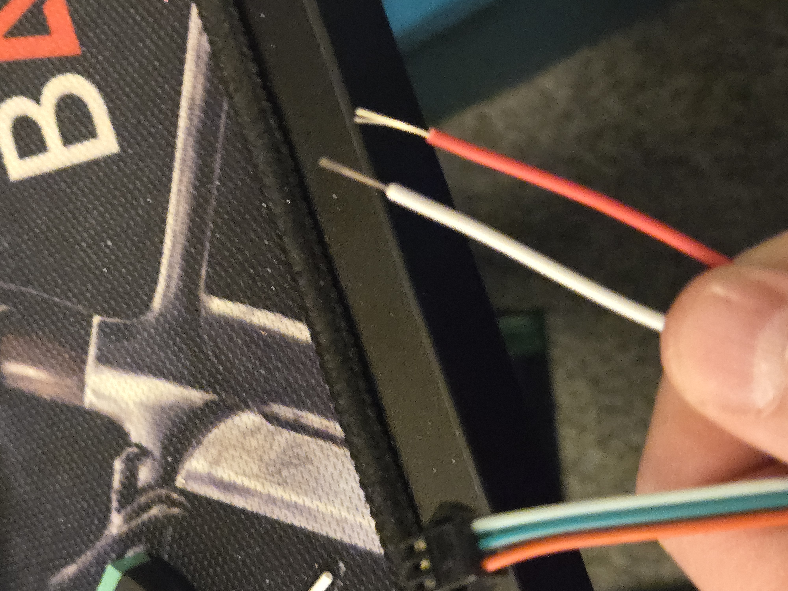
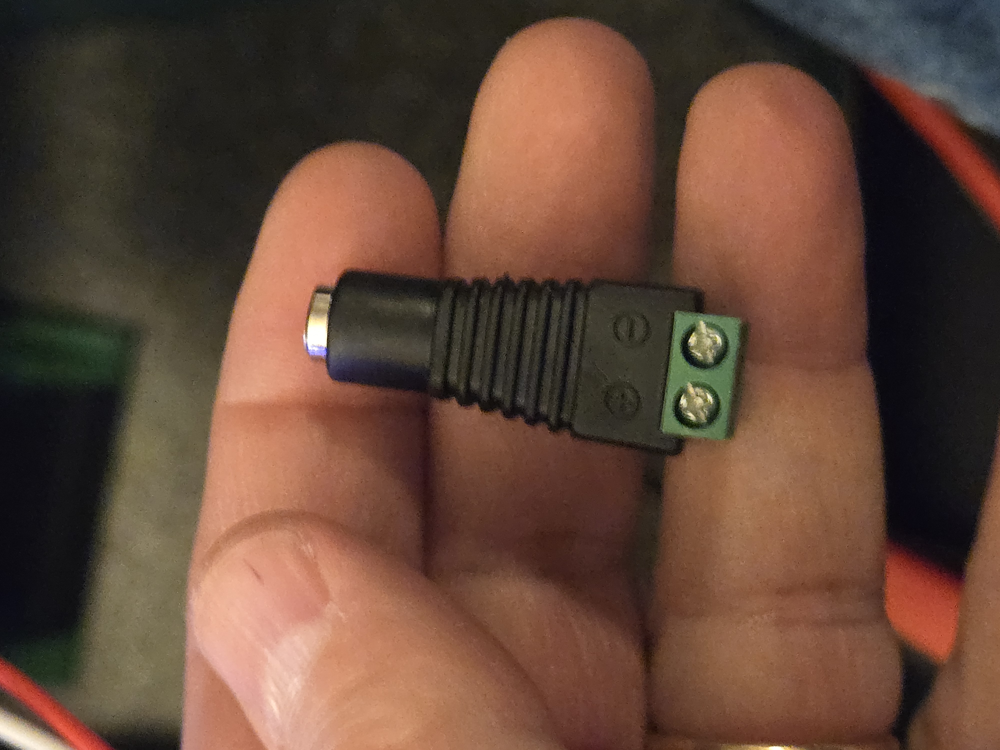
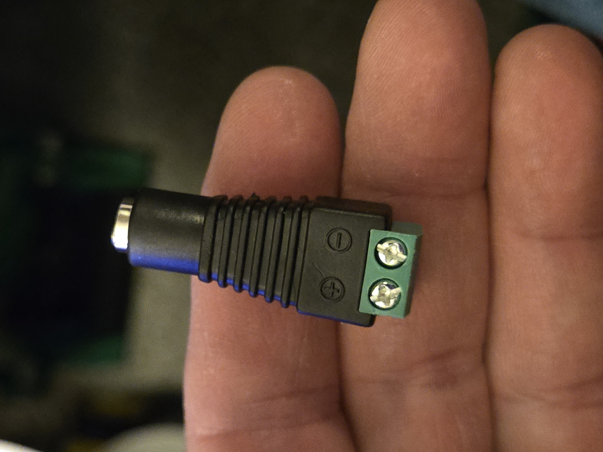
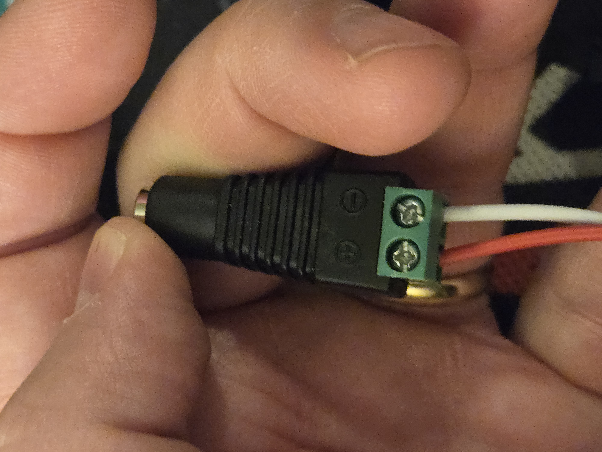
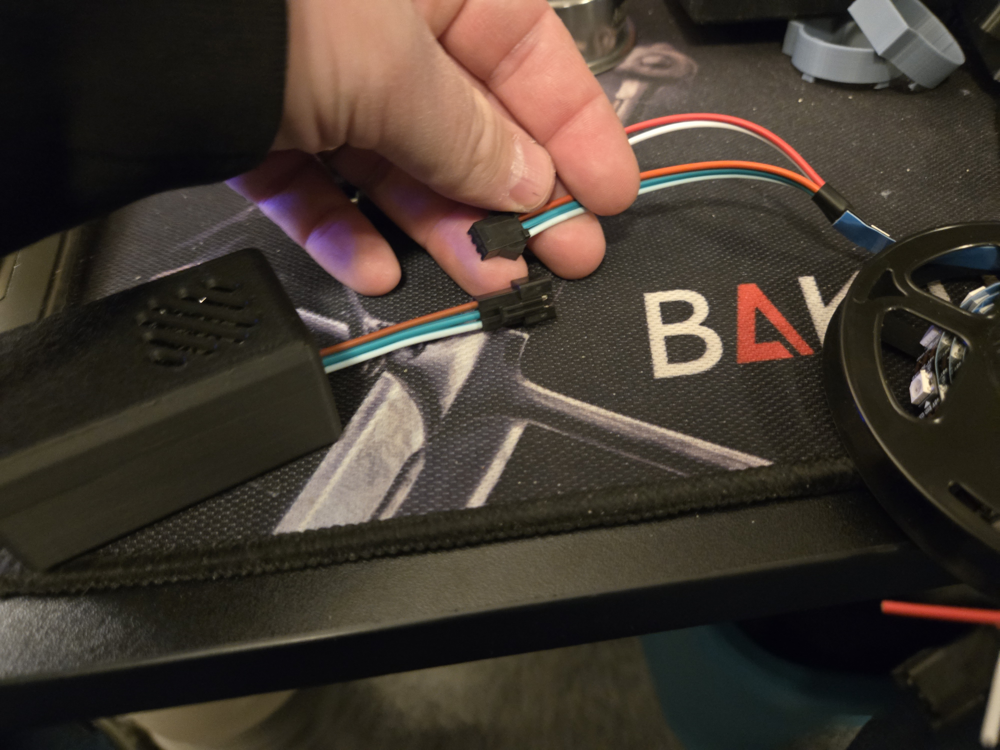
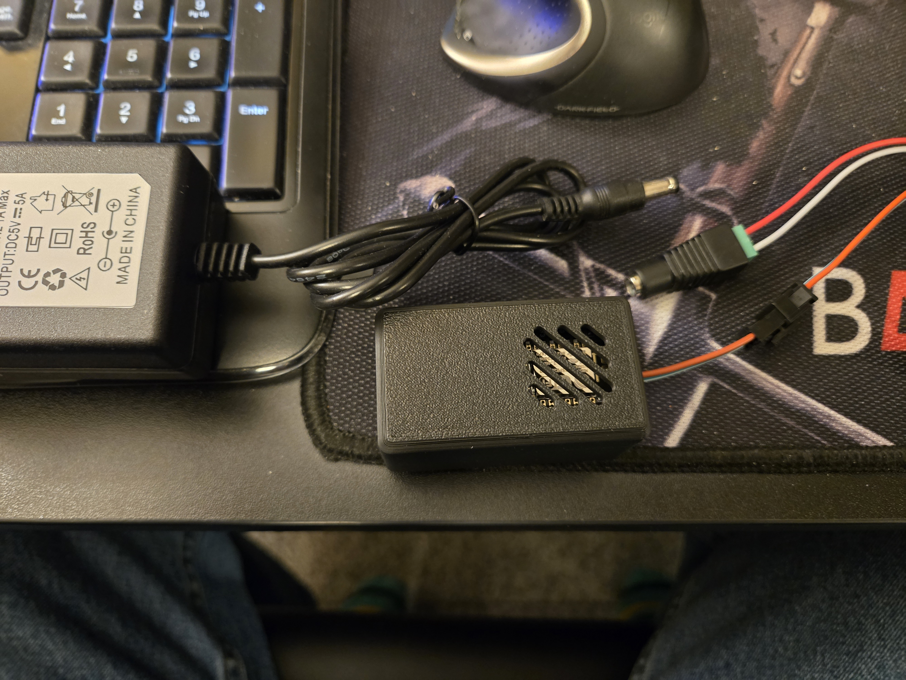
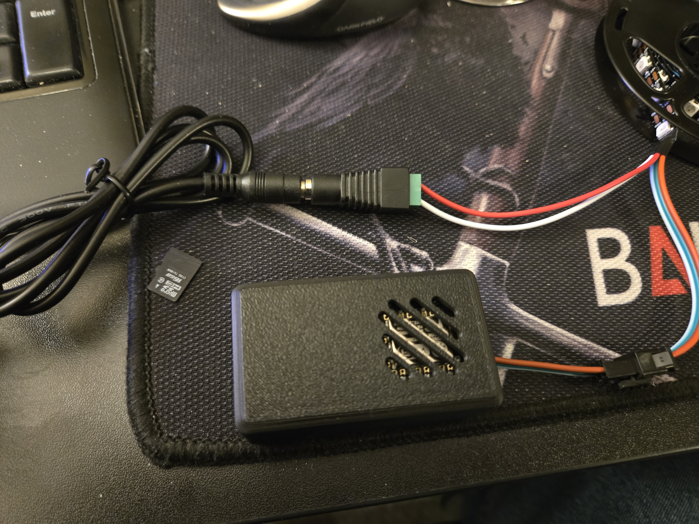

# Connect the parts together

1. Strip the power wires from the LED strip.
    - 
    - 
2. Take the power adapter and unscrew the screws.
    - 
    - 
3. Connect the Power Wires to the Power Adapter.
    - Insert the stripped part of the white power wire into the negative (-) side of the power adapter and tighten the screw for that side.
    - Insert the stripped part of the red power wire into the positive (+) side of the power adapter and tighten the screw for that side.
    - 
4. Connect the wire connector from the esp8266 board to the wire connector from the WS2812B LED Strip.
    - 
    - 
5. Connect the power adapter to the power supply.
    - 
    - 

Head back over to the [Main Page](./README.md) to continue.
