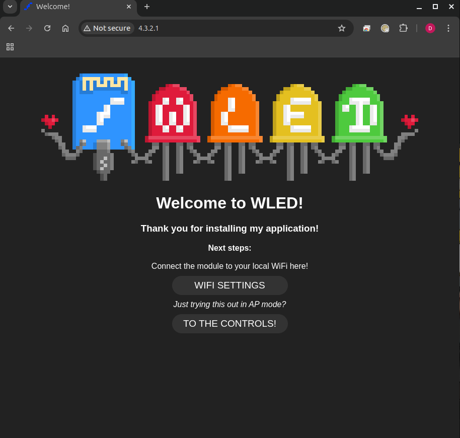
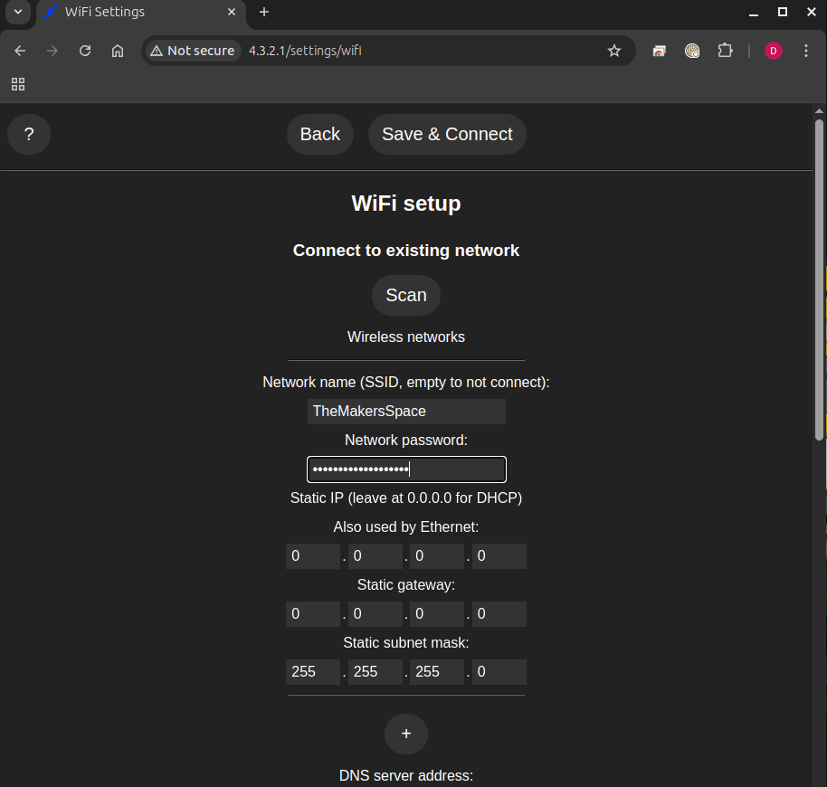

# How to connect to WLED when I get it home

1. Plug the power supply in to boot up the WLED device
2. Connect your phone or computer to `WLED-{name}` using password `wled1234` where `{name}` is the name you gave your device.
   - 
3. Open a browser and go to `http://wled-{name}.local` where `{name}` is the name you entered in mDNS during class (probably the same as the SSID you connected to).
   - 
   - 
4. Configure your Wi-Fi settings and restart the device.
   - 
   - Enter Wi-Fi SSID and Passphrase Manually or use Scan button and select.
     - 
     - 
   - Click "Save & Connect".
     - 
5. Connect your computer/phone to your home network.
6. Navigate to `http://wled-{name}.local`.

Return to the [Main Page](./README.md)
