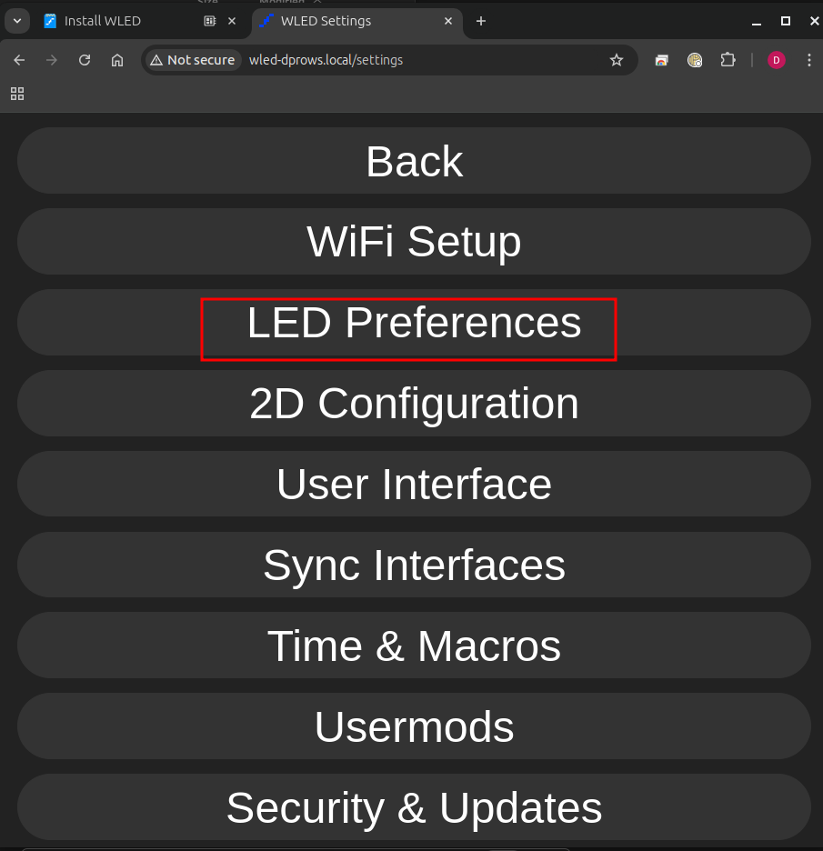
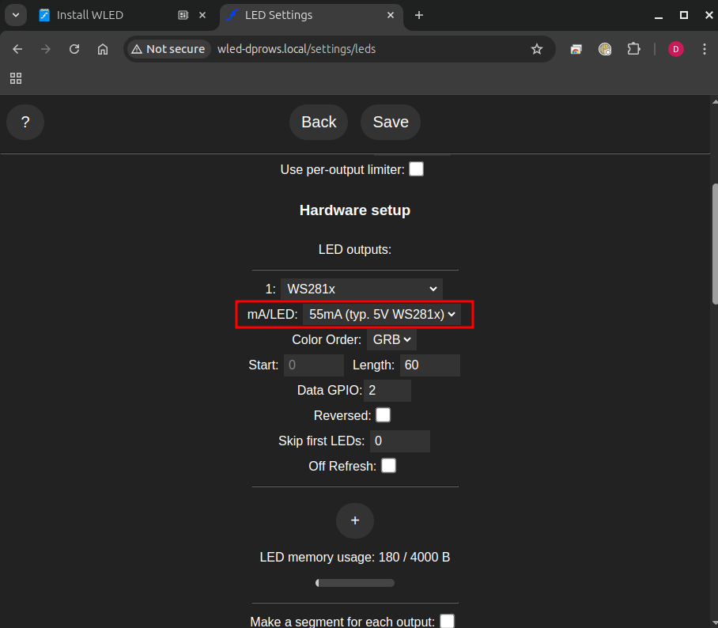
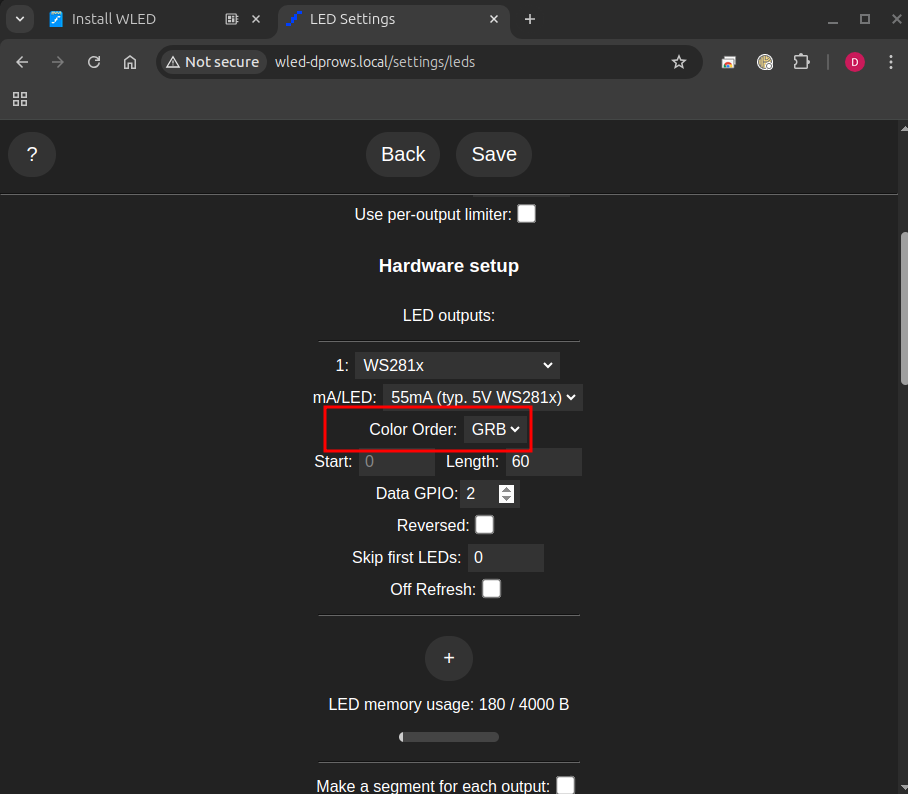

# Install and Configure WLED on an ESP8266 NodeMCU

## Requirements

- ESP8266 NodeMCU board
- USB to Micro-USB cable
- Computer with Windows, macOS, or Linux
- Connect your computer to `TheMakersSpace` Wi-Fi using password `Godisthemastermaker`

## Step 1: Install WLED Using the Web Installer

1. Open a browser and visit [https://install.wled.me](https://install.wled.me).
   - 
2. Connect the ESP8266 to your computer via USB.
   - 
3. Click "Install" and select your ESP8266 device from the list.
   - 
4. Follow the on-screen instructions to flash WLED to your device.
   - 
   - 
   - 
   - 
   - 
   - 
   - 
   - The following is what came up on my Ubuntu machine to configure Wi-Fi.
     - 
     - 
   - If your's went through the Wi-Fi configuration, you can skip to [Step 1a: Configuring WLED](#step-1a-configuring-wled)
   - If your's did not have the option to configure Wi-Fi, move onto [Step 1b: Connect to WLED](#step-1b-connect-to-wled)

## Step 1a: Update Wi-Fi settings

1. Click "VISIT DEVICE".
   - 
2. Click "Config".
   - 
3. Click "WiFi Setup".
   - 
4. Scroll down and update mDNS address and AP SSID
   - Update mDNS name.
     - 
   - Update AP SSID.
     - 
   - Click "Save & Connect".
     - 

## Step 1b: Connect to WLED

1. After flashing, restart the ESP8266.
   - 
   - 
2. It will create a Wi-Fi network named `WLED-AP`.
   - 
3. Connect to `WLED-AP` using password `wled1234`.
   - 
4. Open a browser and go to `http://4.3.2.1` to access the WLED web interface.
   - 
   - 
5. Configure your Wi-Fi settings and restart the device.
   - 
   - Enter Wi-Fi SSID and Passphrase Manually or use Scan button and select.
     - 
     - 
   - Update mDNS name.
     - 
   - Update AP SSID.
     - 
   - Click "Save & Connect".
     - 
6. Connect your computer to `TheMakersSpace` Wi-Fi using password `Godisthemastermaker`.
   - 

## Step 2: Configure WLED

1. Open a browser, if not already open, and go to `http://wled-{name}.local` where `{name}` is the name you entered in the `Update AP Name` above
   - 
   - 
2. Click "Config".
   - 
3. Click "LED Preferences".
   - 
4. Set `Maximum PSU Current:` to the Amperage of our Power Supply, which is `10000`mA.
   - This will limit our power use to a safe amount within our power supply's limits.
   - Note: this power supply is much larger than we need for the 3' LED strips we are using and we can ignore the high current warning, but pay attention to it if you are using a longer strip later.
   - 
5. Verify `mA/LED"` is set to `55mA(typ. 5V WS281x)`.
   - If doing a project later, set it according to your LED's being used.
   - This setting helps in the calculation of power draw.
   - 
6. Note the `Color Order:` defaults to GRB (Green Red Blue).
   - If you are doing a project and colors are not correct, this may need changed to get the order of the LEDs correct.
   - 
7. Scroll down and set `Length:` to 60.
   - 
8. Note the `Data GPIO:` setting defaults to 2.
   - This is the GPIO pin the green wire in our project is connected to.  Most ESP boards has this labeled as D4, but verify based on the board you have selected for your project.  The GPIO pin can be changed if needed. See the WLED documentation for more detail at the URL at the end of this document.
9. Click "Save".
   - 
10. Click "User Interface".
    - 
11. Update `Server description:`.
    - This is used in the mobile app and automation systems for the name of the device.
    - 
12. Click "Save".
    - 
13. Click "Back".
    - This will take you out of the Config Menu.
    - 

## Troubleshooting

- If the ESP8266 is not detected, try using a different USB cable or port.
- Make sure you are using a compatible browser (Chrome or Edge recommended).
- If the device does not start WLED, try reinstalling via [https://install.wled.me](https://install.wled.me).

For more details, visit the WLED Knowledge Base: [https://kno.wled.ge](https://kno.wled.ge)

Enjoy your WLED-powered lighting setup!
