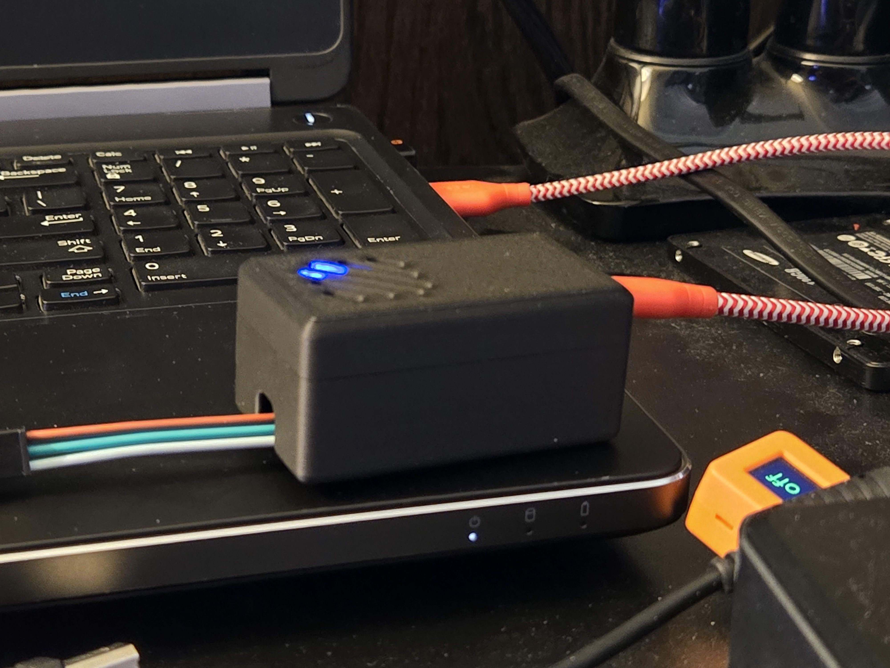

# TheMakersSpace-WLED

WLED - The first class of The Maker's Space at LBC on Monday, March 10, 2025

## Items in Kit

- [ESP8266 NodeMCU V3](https://support.envistiamall.com/kb/nodemcu-v3-lua-esp8266-esp-12e-ch340g-wifi-internet-of-things-development-board/)
- [BTF Lighting 3.28', 60 LED, WS2812B LED Strip](https://a.co/d/fOVGHaN)
- [5V 5A 25W Power Supply](https://a.co/d/1ltHFCJ)
- Case for the ESP8266
  - Designed by Don Potburry
  - 

## Install and Configure WLED

[Install and Configure WLED on an ESP8266 NodeMCU](./Install_WLED.md)

## It worked in class, what do I do when I get home?

[How to connect to WLED when I get it home](./At_Home.md)
